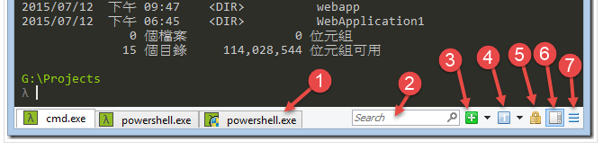

cmder，Win 下超好用的命令行操作工具。

<!-- more -->

Windows 自带的`cmd`有如下缺点：

1.  窗口 size 不能便捷缩放
2.  复制文本，不能直接用鼠标拷贝，还需要多一道菜单操作；而且，还只能块状拷贝，而不是按行字符，极其不便
3.  不支持多 Tab 页，多窗口管理不便
4.  界面丑陋，只有黑白界面，而且不支持文字颜色区分。

以上问题`cmder`都可以解决 ~

## 安裝

官网地址：[http://cmder.net/](http://cmder.net/)

下载的时候，有两个版本，分别是`mini`与`full`版；

*   ` mini`版功能简单，很小巧，只有 4M 多，主要是 `cmd` 和 `powershell`
*   `full`版自带了 msysgit, 压缩包 23M, 除了 git 本身这个命令之外，里面可以使用大量的 linux 命令；比如 grep, curl（没有 wget)； 像 vim, grep, tar, unzip, ssh, ls, bash, perl 对于爱折腾的 Coder 更是痛点需求。

下载完成后，将下载的压缩包解压到你想放置的目录。点击`Cmder.exe`即可运行。

## 界面介绍

<!--  -->


如上图示编号的部分说明如下：

1.  Cmder 常用快捷键
    跟一般浏览器页签操作习惯一致：

    *   可以利用`Tab`，自动路径补全（爽，赞！)；

    *   可以利用 **Ctrl+T** 建立新页签；

    *   利用 **Ctrl+W** 关闭页签；
    *   还可以透过 **Ctrl+Tab** 切换页签；
    *   **Alt+F4**：关闭所有页签

    *   **Alt+Shift+1**：开启 cmd.exe

    *   **Alt+Shift+2**：开启 powershell.exe

    *   **Alt+Shift+3**：开启 powershell.exe （系统管理员权限）

    *   **Ctrl+1**：快速切换到第 1 个页签

    *   **Ctrl+n**：快速切换到第 n 个页签 ( n 值无上限）

    *   **Alt + enter**： 切换到全屏状态；

    *   **Ctr+r** 历史命令搜索；
    *   **End, Home, Ctrl** : Traversing text with as usual on Windows

2.  可在视窗内搜寻画面上出现过的任意关键字。

3.  新增页签按钮，可透过滑鼠新增页签。

4.  切换页签按钮，可透过滑鼠切换页签。

5.  锁定视窗，让视窗无法再输入。

6.  切换视窗是否提供卷轴功能，启动时可查询之前显示过的内容。

7.  按下滑鼠左键可开启系统选单，滑鼠右键可开启工具选项视窗。 Win+Alt+P ：开启工具选项视窗

## 常用配置

### 启动 Cmder

1.  把 `cmder` 加到环境变量
    可以把`Cmder.exe`存放的目录添加到系统环境变量；加完之后，`Win+r`一下，输入`cmder`即可打开。

2.  添加 `cmder` 到右键菜单
    上一步的把 **cmder** 加到环境变量就是为此服务的

```
// 以系统管理员权限打开 cmd 窗口，输入以下代码，回车即可。
Cmder.exe /REGISTER ALL
```

### 中文乱码问题

依次打开`settings` --> `startup` --> `environment`，添加以下代码，以解决中文乱码问题。
```
set LANG=zh_CN.UTF8
```

### 设置打开时的默认目录

打开设置
选择`Startup-Task`，修改`{cmd::Cmder}`项，把：
```
*cmd /k "%ConEmuDir%\..\init.bat"  -new_console:d:%USERPROFILE%
```
修改成：
```
cmd /k "%ConEmuDir%\..\init.bat"  -new_console:d:E:\
```

重启 `cmder` 之后就可以看到直接已经进入了刚刚设置的 `E:\` 目录。

### 修改命令提示符号 λ

`Cmder`预设的命列列提示符号是`λ`; 如果用着不习惯，可以将这个字元改成`Mac / Linux`环境下常见的`$`符号，具体操作如下：

编辑`Cmder`安装目录下的`vendor\init.bat`批处理文件 (min 版本 15 行），把：

```
@prompt $E[1;32;40m$P$S{git}{hg}$S$_$E[1;30;40m {lamb} $S$E[0m
```
修改成以下即可：
```
@prompt $E[1;32;40m$P$S{git}{hg}$S$_$E[1;30;40m $$ $S$E[0m
```
这个亲测在`cmder.exe`可以，但在`PowerShell.exe`需要另行设置：
打开文件`config/cmder.lua`（prompt.lua 也有版本是这个），将第二行中的`λ`修改为 Linux 下常用的`$`即可。
